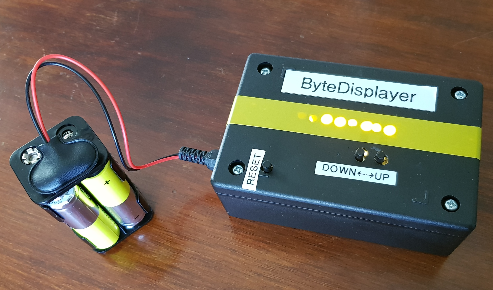
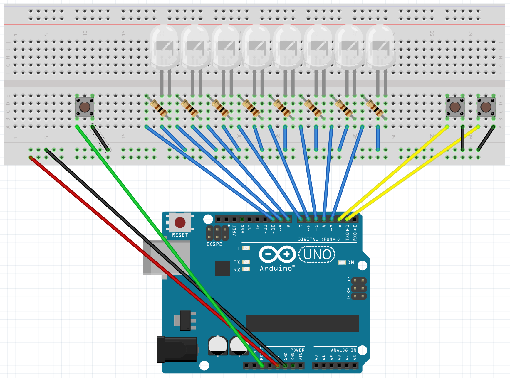

# ByteDisplayer

Displays a byte prepresentation of integer values from 0 to 255 using 8 LEDs.

Parts required:
 * 1 Arduino Uno
 * 8 LEDs and suitable resistors
 * 3 pushbuttons for up/down + reset

Optional parts:
 * Prototyping shield
 * Plastic project box
 * Battery holder

